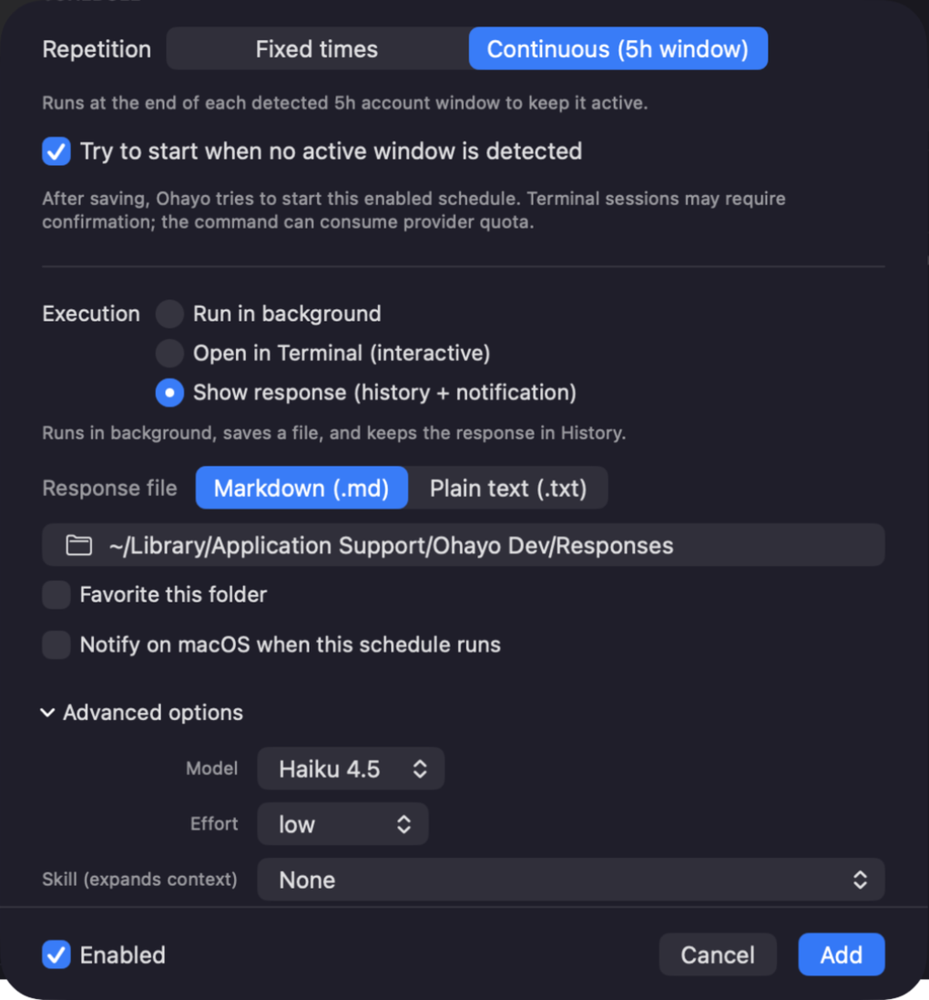
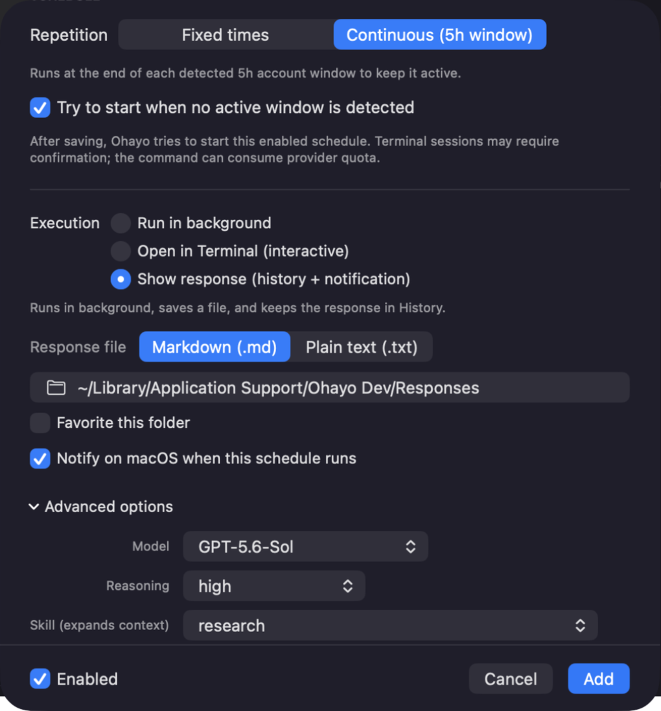
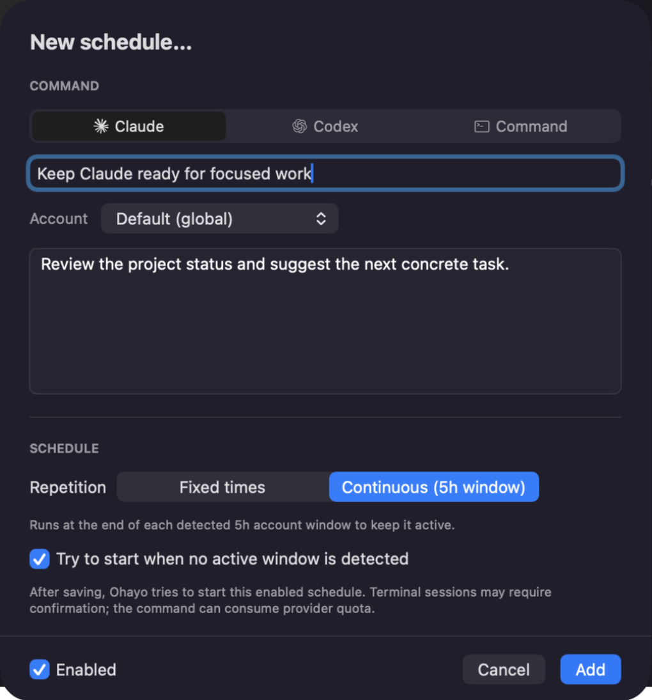
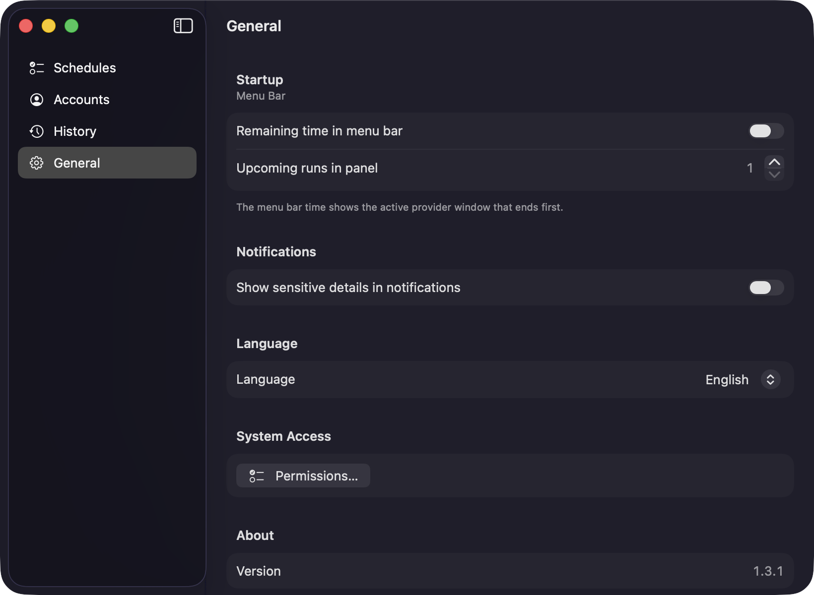
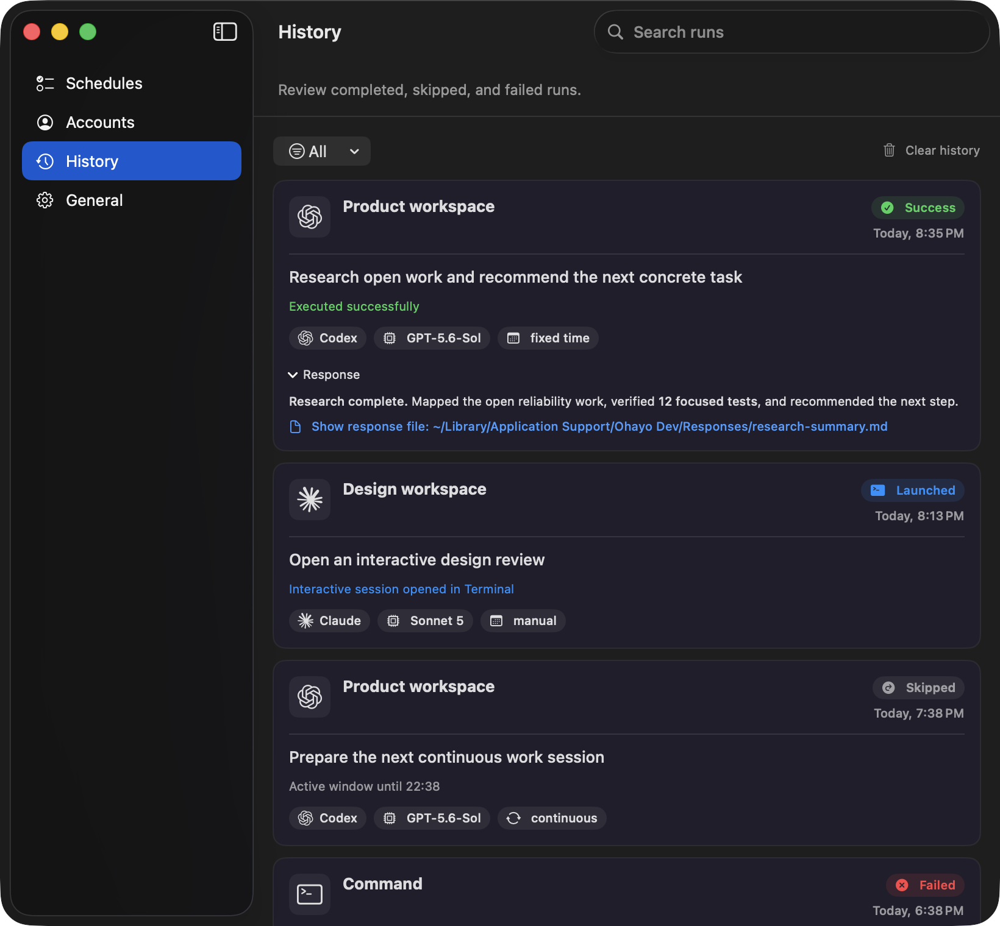

<div align="center">

# Ohayo

### Claude vs Codex — Provider Lab

Configure each Provider on its own terms. Keep scheduling, Usage Window
evidence, responses, notifications, and History in one native macOS menu-bar
control center.

**English** · [Português](README.pt-br.md)

macOS 13+ · Apple Silicon + Intel · Swift + SwiftUI

[Install with Homebrew](#install) ·
[Download the latest DMG](https://github.com/hayashirafael/ohayo/releases/latest)

</div>

<table>
  <tr>
    <td width="50%">
      
    </td>
    <td width="50%">
      
    </td>
  </tr>
  <tr>
    <td><strong>Claude control plane</strong><br>Choose from Ohayo's current Claude model catalog, set effort, reuse an installed Skill, and decide whether Ohayo may pre-authorize basic folder trust.</td>
    <td><strong>Codex control plane</strong><br>Choose an Account-discovered model and compatible reasoning level, reuse an installed Skill, and set Full access, Folder write, or Read-only explicitly.</td>
  </tr>
</table>

Ohayo keeps **Claude Code** and **Codex CLI** native without pretending they
are the same Provider. Each Schedule preserves its selected Account, project,
model controls, permission decision, repetition, and output behavior. The CLIs
remain external prerequisites, installed and authenticated by the user, and
stay responsible for the work they perform.

Shell commands can also run at fixed times, but they do not gain a Claude/Codex
Account, model, Skill, or Usage Window contract.

## Same Schedule canvas. Provider-specific controls.

| | Claude Code | Codex CLI |
| --- | --- | --- |
| **Account** | Native `~/.claude` or a registered custom Claude directory | Native `~/.codex` or a registered custom Codex directory |
| **Model source** | Ohayo's current Claude catalog: Haiku 4.5, Sonnet 5, and Opus 4.8 | Visible models from the selected Account's `models_cache.json`; a built-in fallback is used only when the cache is missing, invalid, or yields no visible models |
| **Depth control** | Effort: low, medium, high, xhigh, or max | Reasoning levels supported by the selected model; an unsupported choice is normalized to that model's supported default |
| **Skill invocation** | An installed Skill prefixes the prompt as `/skill` | An installed Skill prefixes the prompt as `$skill` |
| **Project access** | Separate **Trust this folder for Claude** consent; enabled by default for basic project trust | Explicit **Full access**, **Folder write**, or **Read-only** mode |
| **Execution** | Interactive Terminal hand-off or observable background batch | Interactive Terminal hand-off or observable `codex exec` batch |

The Claude names above describe the catalog in this Ohayo version, not a
permanent guarantee from the Provider. Codex models are even more explicitly
Account-dependent: the selected Account cache is preferred, the fallback is a
resilience path, and no displayed list should be read as universal
availability.

### Claude: model, effort, Skill, and trust

- **Model and effort** are independent Schedule choices from Ohayo's current
  Claude catalog. Availability and execution still belong to the installed
  Claude CLI and selected Account.
- **Skill** selects an installed Claude customization and prepares its native
  invocation. Ohayo ignores Claude customizations by default — this is not a
  sandbox. Selecting a Skill turns that option off so native customizations
  can load. A Skill can expand agent context, but it does not grant filesystem
  access.
- **Folder trust** lets Ohayo pre-authorize basic trust for the selected
  project. External `CLAUDE.md` imports are not pre-approved, and Claude may
  still request separate consent through its own permission flow.
- Native Claude runs without forcing `CLAUDE_CONFIG_DIR=~/.claude`; registered
  custom Accounts receive their own override.

### Codex: Account catalog, reasoning, Skill, and access

- **Model and reasoning** follow the selected Account. Ohayo reads visible
  entries and supported reasoning levels from its cache and leaves
  **Account default** authoritative when no override is selected.
- **Skill** selects an installed Codex Skill and prepares `$skill` invocation.
  It can expand context; it is not a sandbox or permission grant.
- **Full access** is the default and runs without sandbox or approval prompts.
  **Folder write** uses the `workspace-write` sandbox for the selected folder.
  **Read-only** uses the `read-only` sandbox.
- For an interactive trusted session, Ohayo passes an ephemeral official
  project-trust override. It does not rewrite the Account's `config.toml`.

## One shared lane: compatible five-hour Usage Windows



**Continuous** is available to both native Providers. It reconstructs a
compatible five-hour Usage Window from positive local transcript evidence,
skips a redundant Continuous Run while that window is active, and schedules
the next attempt around its end.

```text
Positive local evidence
        ↓
Active five-hour Usage Window
        ↓
Skip redundant Continuous Runs
        ↓
Try again around the detected end
```

> Continuous is evidence-driven automation, not a quota promise.

- Claude requires a real, non-error assistant event with positive token usage.
- Codex requires a real `token_count` event with positive
  `last_token_usage`.
- Authentication, model, network, synthetic, zero-token, unreadable, and
  unknown-schema data never create a fictional Usage Window.
- A new Continuous Schedule may optionally try to start when detection
  conclusively reports no active window. That Run can consume provider quota.
- A delivered bootstrap without positive evidence enters a bounded cooldown;
  it is not retried continuously.

Ohayo does **not** guarantee a provider reset, available quota, a completed Run
every five hours, or 24/7 execution. Provider plans, Account capacity, and
additional limits remain authoritative. Fixed-time Schedules stay independent
and are not suppressed by an active Usage Window.

## From configuration to evidence

```text
Schedule + Account + Provider controls
                    ↓
              Prepared Run
          ↙                         ↘
Background batch              Terminal hand-off
observed by Ohayo             opened for interaction
          ↓                         ↓
Result + response preview          Launched
+ captured file + notification     no final response captured
          ↘                         ↙
                    History
```

### Background batch and Terminal are intentionally different

| Execution | What Ohayo can observe | History contract |
| --- | --- | --- |
| **Background batch** | Process result, bounded stdout/stderr capture, timeout and cancellation; with **Show response**, a rendered response preview and an optional Markdown or plain-text file containing the captured output | Success, failure, skipped, or another observed outcome, with response details when available |
| **Terminal** | The interactive session was handed to Terminal.app | **Launched** — never promoted to Success because Ohayo cannot observe the final exit status |

Without a selected project, Provider Runs use
`~/Library/Application Support/Ohayo/workspace`, not the home directory.
Response files default to
`~/Library/Application Support/Ohayo/Responses`, and favorite response folders
are stored locally.

## Responses, private notifications, and History

<table>
  <tr>
    <td width="42%">
      
    </td>
    <td width="58%">
      
    </td>
  </tr>
  <tr>
    <td><strong>Notify without leaking context</strong><br>Each background Schedule can opt in to a success alert. Observed responses and scheduled failures may also notify; prompt, response, error, and Account details stay hidden unless sensitive details are explicitly enabled in General.</td>
    <td><strong>Read now. Find it later.</strong><br>Observed batch response previews remain with the Run in History and can point to a Markdown or text file containing the captured output. Interactive hand-offs remain Launched.</td>
  </tr>
</table>

Notification permission comes from macOS. Ohayo may notify for an opted-in
success, an observed response, or a scheduled failure. These notifications are
separate from Claude hooks or Codex notifications and do not increase what
Ohayo can observe from an interactive Terminal session.

History keeps Provider, Account snapshot, model, origin, time, and the outcome
Ohayo actually observed. It distinguishes successful, failed, skipped, missed,
and launched Runs instead of presenting every Run as completed work.

## Quick start

1. Open Ohayo and complete or dismiss the non-blocking setup guide.
2. In **Accounts**, confirm the Claude and Codex Accounts you want to use.
3. In **Schedules**, choose **New Schedule…** and select the Provider.
4. Configure that Provider's model controls, Skill, project access, execution,
   and either **Fixed times** or **Continuous** repetition.
5. Enable **Show response** for an observable batch result, or keep Terminal
   for an interactive hand-off.
6. For background Runs, opt in to success notifications when useful and
   inspect each Run in **History**.

Immediately before a Claude/Codex Run, Ohayo checks the selected Account's
authentication. If it is not logged in, no agent session is opened; History
records the Run and shows the login command for that Account directory.

## Also included

| Daily control | Operational guardrails |
| --- | --- |
| **Menu-bar first** — See the next 1–5 Runs and their Accounts without keeping a Dock icon visible. A Dock icon appears only while a standard Ohayo window is open. | **Accounts ready** — Pause or resume each Account independently. The read-only Provider Doctor checks CLI installation and authentication without running a prompt. |
| **Two repetition modes** — Combine times with weekdays in **Fixed times**, or use one enabled **Continuous** Schedule per Account. | **Bounded batch** — Optionally limit background execution to a positive whole number of minutes. Interactive Terminal sessions remain unsupervised. |
| **Native controls** — Choose English or Portuguese, start Ohayo at login, and open **General** with the standard `⌘,` shortcut. | **One central window** — Move between Schedules, Accounts, History, and General while the compact menu-bar panel stays focused on upcoming Runs. |

## Install

### Homebrew

```bash
brew tap hayashirafael/tap
brew trust --cask hayashirafael/tap/ohayo
brew install --cask ohayo
```

Homebrew installs the latest published release. Installations older than
v1.2.0 need one final `brew upgrade --cask ohayo`; releases since v1.2.0 can
also update through **Ohayo → General → About → Check for Updates…**.

### DMG

Download `Ohayo-<version>.dmg` from the
[latest release](https://github.com/hayashirafael/ohayo/releases/latest), open
it, and drag **Ohayo** to **Applications**.

Published releases since v1.2.0 are universal for Apple Silicon and Intel.
When Apple credentials are unavailable, tester releases use ad-hoc signing
without notarization. Gatekeeper may require manual approval on first launch,
and macOS may ask for protected-folder access again after an update because an
ad-hoc code identity is not stable. With all Apple credentials configured, the
release workflow uses Developer ID, hardened runtime, notarization, and
stapling.

## Requirements

- macOS 13+
- [Claude Code](https://claude.com/claude-code), installed and logged in only
  for Claude Schedules
- [Codex CLI](https://github.com/openai/codex), installed and logged in only
  for Codex Schedules
- Swift 5.9+ through Xcode or Command Line Tools, only when building from source

## Permissions and privacy

<details>
<summary><strong>First run and macOS permissions</strong></summary>

The packaged app shows a non-blocking setup guide once. It performs read-only CLI installation and authentication checks for configured Claude/Codex Accounts. Those checks do not run a prompt, begin a login, or intentionally consume provider quota.

The guide can request notification access, test Terminal automation for interactive sessions, and optionally enable Launch at Login. Closing it does not disable Ohayo. Reopen it from the menu panel or **Ohayo → General → System Access → Permissions…**.

If access was denied, update it in **System Settings → Notifications → Ohayo** or **System Settings → Privacy & Security → Automation**. For a protected project such as Documents, choose **Allow** in the macOS prompt; Ohayo cannot grant that permission for you.

A Developer ID-signed app can keep the same authorization identity across updates. An ad-hoc local or tester rebuild has a different code identity, so macOS may ask again.

</details>

<details>
<summary><strong>Local data, skills, and sensitive content</strong></summary>

Usage Window detection reads supported local Claude/Codex transcripts and does not call a provider API. Accounts, Schedules, favorite folders, and History are stored locally. Sparkle and the provider CLIs still use their own network access, so Ohayo is not presented as a fully offline product.

Batch prompts are sent through stdin instead of the process argument list. macOS notifications hide prompt, response, error, and Account details by default.

A selected Skill can expand context but does not grant access. Codex access mode or Claude's own permission flow remains authoritative for the filesystem.

</details>

## Updates

Releases since v1.2.0 check the signed Sparkle feed daily. When an update is
available, its version appears in the menu-bar panel and in
**General → About**, where **Update Now** opens Sparkle's **Install and
Relaunch** flow. Use **Check for Updates…** for an immediate check.

Sparkle validates release archives and `appcast.xml` with its EdDSA key.
Sparkle's GitHub network access is separate from passive local Usage Window
detection. Apple credentials determine whether a published build can use
Developer ID signing and notarization.

## Technical boundaries

<details>
<summary><strong>Accounts, identity, queues, and retries</strong></summary>

Ohayo detects `~/.claude` and `~/.codex` when present; additional Accounts can be registered with aliases. Provider identity is persisted, and an unavailable custom Account is not silently reinterpreted as another Provider or as the default Account.

Canonical filesystem paths are Account identity. Runs are FIFO per Provider/Account, while different Accounts may advance concurrently. Missing CLI, authentication, permission, or configuration becomes a needs-attention state instead of a repeating alert loop. Known transient failures use bounded retries.

Only one Ohayo instance runs per runtime profile. Production and the isolated Dev profile may coexist.

</details>

<details>
<summary><strong>CLI and response behavior</strong></summary>

Native Claude runs with `CLAUDE_CONFIG_DIR` unset; custom Claude Accounts receive their configured override. Codex receives the selected `CODEX_HOME`. Shell Schedules receive neither provider variable.

Background Claude uses its non-interactive print mode. Background Codex uses `codex exec` with the selected model, reasoning, and access settings. Process capture is bounded while preserving its beginning and error-bearing tail; History is therefore a diagnostic view, not an unbounded transcript archive. When **Show response** is enabled, Ohayo keeps a rendered preview in History and can save the bounded captured output atomically as Markdown or plain text.

</details>

## Build from source

<details>
<summary><strong>Production-style local app and DMG</strong></summary>

```bash
git clone https://github.com/hayashirafael/ohayo.git
cd ohayo
swift test
./scripts/make-app.sh # build/Ohayo.app (ad-hoc signed)
./scripts/make-dmg.sh # requires: brew install create-dmg
open build/Ohayo.app
```

The DMG is written as `build/Ohayo-<version>.dmg`.

</details>

<details>
<summary><strong>Isolated Ohayo Dev channel</strong></summary>

Use the development bundle when the installed Ohayo app and its data must stay untouched:

```bash
./scripts/make-dev-app.sh
open "build/Ohayo Dev.app"
orca computer get-app-state --app io.github.hayashirafael.Ohayo.dev --json
```

If Computer Use cannot inspect the menu-bar surface directly, expose the central window in this development channel:

```bash
open "build/Ohayo Dev.app" --args --ui-testing
```

`Ohayo Dev.app` uses bundle identifier `io.github.hayashirafael.Ohayo.dev`, its own Application Support directory, preferences domain, workspace, response folder, and single-instance lock. It does not copy production Accounts, Schedules, History, or preferences. In-app updates and Launch at Login are unavailable, and its blue icon has a visible **DEV** badge.

</details>

---

Ohayo is built with Swift 5.9, SwiftUI `MenuBarExtra`, Swift Package Manager,
and Sparkle.
